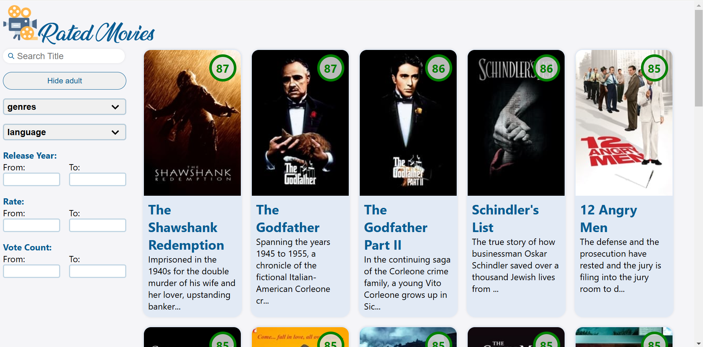
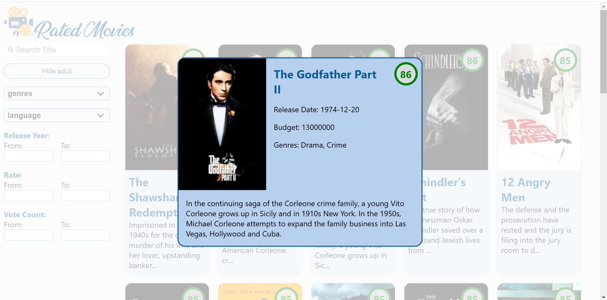
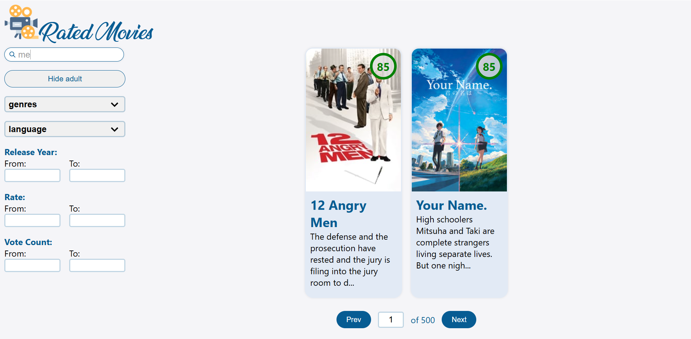
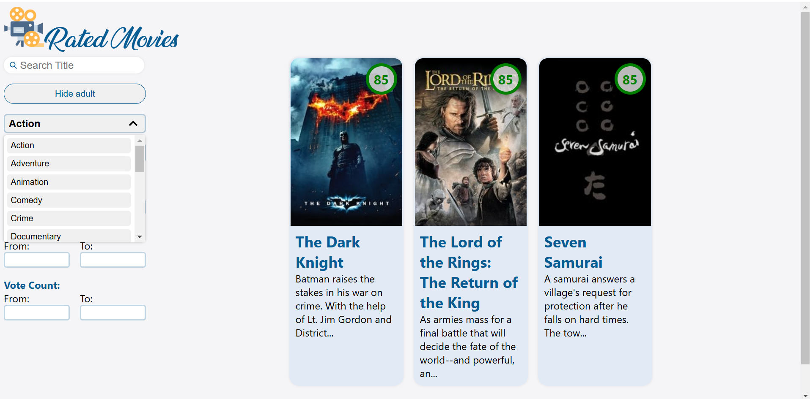

# Rated Movies

Rated Movies is a React-based web application that lets users explore top-rated movies from The Movie Database (TMDB). The app offers powerful filtering options, making it easy to discover movies based on different criteria

## Preview






## Tech Stack

- React (Create Vite App)
- Node.js Router
- Fetch TMDB API (https://developer.themoviedb.org/reference/intro/getting-started)

## Installation & Setup

1. **Clone the repository**
   ```bash
   git clone https://github.com/perezShaked/rated-movies.git
   cd rated-movies
   ```
2. **Install dependencies**

   ```bash
   npm install
   ```

3. **Run client and server**
   ```bash
   npm start
   ```

## Project Structure

├── 📂 client # Frontend - React (Vite + TypeScript)
│ ├── 📂 public # Static assets
│ ├── 📂 src # Source code
│ │ ├── 📂 components # Reusable UI components
│ │ ├── 📂 context # Global state management - for future use
│ │ ├── 📂 hooks # Custom React hooks
│ │ ├── 📂 services # API calls
│ │ ├── 📂 utils # Helper functions
│ │ ├── App.tsx # Main React component
│ │ ├── main.tsx # Entry point
│ │ ├── index.css # Global styles
│ ├── package.json # Frontend dependencies
│
├── 📂 server # Backend - Node.js (Express + TypeScript)
│ ├── 📂 api # API routes
│ ├── 📂 config # Configuration files (API urls)
│ ├── 📂 dal # Data Access Layer (fetch TMDB API)
│ ├── 📂 types # Type definitions
│ ├── 📂 utils # Utility functions - for future use
│ ├── 📂 validation # Input validation logic
│ ├── server.ts # Main server entry point
│ ├── package.json # Backend dependencies
│ ├── tsconfig.json # TypeScript configuration
